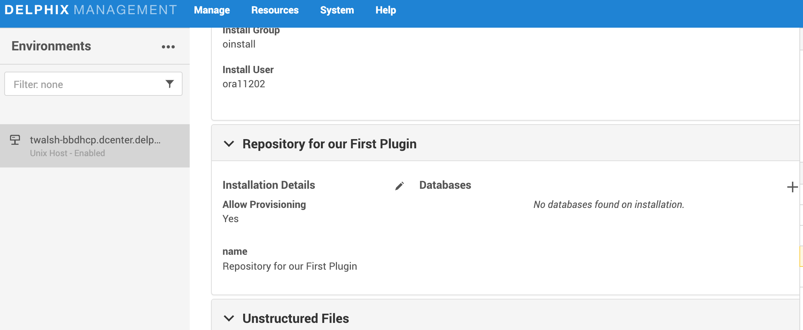
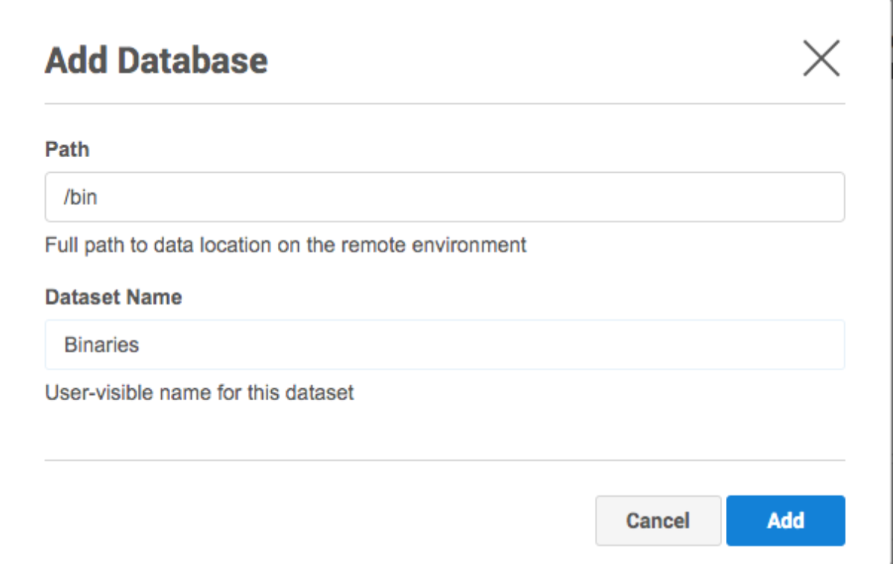

# Discovery

## What is Discovery?
In order to ingest data from a source environment, the Delphix Engine first needs to learn information about the data: Where does it live? How can it be accessed? What is it called?

[Discovery](/References/Glossary/#discovery) is the process by which the Delphix Engine learns about remote data. Discovery can be either:

- [automatic](/References/Glossary/#automatic-discovery) — where the plugin finds the remote data on its own
- [manual](/References/Glossary/#manual-discovery) — where the user tells us about the remote data

For our first plugin, we will be using a mix of these two techniques.

## Source Configs and Repositories

### What are Source Configs and Repositories?

A [source config](/References/Glossary/#source-config) is a collection of information that Delphix uses to represent a dataset. Different plugins will have different ideas about what a "dataset" is (an entire database? a set of config files? an application?). For our first plugin, it is simply a directory tree on the filesystem of the remote environment.

A [repository](/References/Glossary/#repository) represents what you might call "data dependencies" -- anything installed on the remote host that the dataset depends on. For example, if you are working with a Postgres database, then your repository will represent an installation of a particular version of the Postgres DBMS. In this plugin, we do not have any special dependencies, except for the simple existence of the unix system on which the directory lives.

We will be using automatic discovery for our repositories, and manual discovery for our source configs.

Earlier when we ran `dvp init`a file named `plugin_config.yml` was created, if you open this file, you will see a line like this:
```
manualDiscovery: true
```
This enables manual source config discovery, which is what we want.

### Defining Your Data Formats
Because each plugin will have different ideas about what a repository or source config represents, different plugins will have different sets of information that they need to collect and store.

Delphix needs to know the format of this information. How many pieces of information are collected? What are they called? Are they strings? Numbers?

For our first plugin, we do not need a lot of information,  refer to (link to advanced example) for a more complicated example. We use no special information about our repositories (except some way for the user to identify them). For source configs, all we need to know is the path to the directory from which we will be ingesting data.

The plugin needs to describe all of this to the Delphix Engine, and it does so using [schemas](/References/Glossary/#schema).  Recall that when we ran `dvp init`, a file full of bare-bones schemas was created. As we build up our first toolkit, we will be augmenting these schemas to serve our needs.

#### Repository Schema
Open up the `schema.json` file in your editor/IDE and locate `repositoryDefinition`, it should look like this:

```json
{
    "repositoryDefinition": {
        "type": "object",
        "properties": {
            "name": { "type": "string" }
        },
        "nameField": "name",
        "identityFields": ["name"]
    }
}
```

Since we do not have any special dependencies, we can just leave it as-is.

For detailed information about exactly how repository schemas work, see [the reference page](/References/Schemas).

In brief, what we are doing here is saying that each of our repositories will have a single property called `name`, which will be used both as a unique identifier and as the user-visible name of the repository.

#### Source Config Schema

For source configs, the bare-bones schema is not going to be good enough. Recall that for us, a source config represents a directory tree on a remote environment.

Locate the `sourceConfigDefinition` inside the `schema.json` file and modify the definition so it looks like this:

```json
"sourceConfigDefinition": {
    "type": "object",
    "required": ["name", "path"],
    "additionalProperties": false,
    "properties": {
        "name": {
          "type": "string",
          "prettyName": "Dataset Name",
          "description": "User-visible name for this dataset"
        },
        "path": {
          "type": "string",
          "format": "unixpath",
          "prettyName": "Path",
          "description": "Full path to data location on the remote environment"
        }
    },
    "nameField": "name",
    "identityFields": ["path"]
},
```

Now, we have two properties, a property `name` serving as the user-visible name of the source config and `path` which tells us where the data lives on the remote host. Note  we are using `path` as the unique identifier.

Because we are using manual discovery, the end user is going to be responsible for filling in values for `name` and `path`. So, we have added some things to our schema that we did not need for repositories.

The `prettyName` and `description` entries will be used by the UI to tell the user what these fields mean.

Because we set `additionalFields` to `false`, this will prevent users from supplying properties other than `name` and `path`.

Finally, we have specified that the `path` property must be a well-formatted Unix path. This allows the UI to enforce that the format is correct before the user is allowed to proceed. (Note this only enforces the format, and does not actually check to see if the path really exists on some remote environment!)

Refer to (link to reference) for more details about these entries, and for other things that you can do in these schemas.

## Implementing Discovery in Your Plugin

### About Python Code

As described in the overview section, plugins customize the behavior of the Delphix Engine by providing Python code. Each customizable piece of behavior is called a "plugin operation". The plugin provides separate Python functions for each of the operations that it wants to customize.

Right now, we are concerned with discovery. There are two customizable operations related to automatic discovery, one for repositories and one for source configs. In both cases, the job of the Python method is to automatically collect whatever information the schemas (see above) require, and to return that information to the Delphix Engine. The Delphix Engine will run these customized operations whenever a new environment is added, or when an existing environment is rediscovered.


### Repository Discovery
For repositories, we will need to write a "repository discovery" operation in Python. This operation will examine a remote environment, find any repositories, and return information about them to the Delphix Engine.

As a reminder, our only external dependency on the remote environment is simply the existence of a filesystem. Since every Unix host has an environment, that means we will have exactly one repository per remote environment. Therefore, our repository discovery operation can be very simple.

Recall that the `dvp init` command we ran created a file called `src/plugin_runner.py`. Open this file in your editor/IDE. Change the content so that it looks like this:


```python
import dlpx.virtualization import libs
from dlpx.virtualization.platform import Plugin
from dlpx.virtualization.platform import Mount
from dlpx.virtualization.platform import MountSpecification
from generated.definitions import RepositoryDefinition, SnapshotDefinition, SourceConfigDefinition

plugin = Plugin()

@plugin.discovery.repository()
def repository_discovery(source_connection):
    repository = RepositoryDefinition('Repository for our First Plugin')
    return [repository]
```

!!! tip
    Be careful to always use consistent indentation in Python code!

Taking this line-by-line, here is what's happening in our new method::

```python
import dlpx.virtualization import libs
from dlpx.virtualization.platform import Plugin
from dlpx.virtualization.platform import Mount
from dlpx.virtualization.platform import MountSpecification
from generated.definitions import RepositoryDefinition, SnapshotDefinition, SourceConfigDefinition
```
These lines make certain functionality available to our Python code. Some of this functionality will
be used just below, as we implement discovery. Others will be used later on, as we implement
ingestion and provisioning.

```python
plugin = Plugin()
```

The python expression `Plugin()` creates a Python object which allows us to define our plugin types. We have the ability to do this because of the `import Plugin` statement above.

This object is stored in a variable we have elected to call `plugin`. We are free to call this variable anything we want, so long as we also change the `entryPoint` line in the `plugin_config.yml` file. We will just leave it as `plugin`.


```python
@plugin.discovery.repository()
def repository_discovery(source_connection):
```
This begins the definition of a function we have elected to call `repository_discovery`.

We are using a Python [decorator](/References/Glossary/#decorator) which signals to the Delphix Engine that this is the function which should be called when it is time to do repository discovery. Note that we are using our `plugin` variable here as part of the decorator.

The Delphix Engine will pass us information about the source environment in an argument called `source_connection`. As it happens, we will not need to use this information at all in our case.


```python
    repository = RepositoryDefinition('Repository for our First Plugin')
```

This creates a Python object that corresponds to the format defined by our repository schema. That is to say, this object will have exactly one string property called `name`. Here, we are setting this `name` property to be the string `Repository for our First Plugin`.

We have access to this datatype because of the `import RepositoryDefinition` statement from above.


```python
    return [repository]
```
Finally, we return a list that contains just this one object.

Recall that we must return information about **all** of the repositories we discover. Since we are only discovering one repository, our list only has one object in it.

### Source Config Discovery

For source configs, we will rely solely on manual discovery -- the user will tell us which directories they want to ingest from. We still have to write a source config discovery function, but it will not do anything.

Add the following code to the bottom of `plugin_runner.py`.
```
@plugin.discovery.source_config()
def source_config_discovery(source_connection, repository):
    return []
```
Notice that for this function, there are now two arguments.  A `source_connection` argument and a `repository` argument.

The job of this function is to return only source configs associated with the given `repository`. This function will be called once per repository. In our case, that means it will only be called once.

Because we want to supply **no** automatically-discovered source configs, this function simply returns an empty list.


## How to Run Discovery in the Delphix Engine

Let us make sure discovery works!

1. Run the `dvp build` commands, as before. This will build the plugin, with all of the new changes, and create an artifact.

2. Run `dvp install -e <engine> -u <user>`, as before. This will get all the new changes onto the Delphix Engine.

3. Once the new plugin is uploaded, add a remote unix environment to your engine. To do this, go to **Manage > Environments**, click **Add**, answer the questions, and **Submit**. (If you already have an environment set up, you can just refresh it).

  To keep an eye on this discovery process, you may need to open the **operation** tab on the UI. If any errors happen, they will be reported here.

4. After the automatic discovery process completes, go to the **Databases** tab, you will see an entry for **Repository For Our First Plugin**. This is the repository you created in your Python code.



Notice that it says "No databases found on installation". This is because we chose not to do automatic source config discovery.

However, because we have allowed manual source config discovery, you can add your own entries by clicking the plus sign (**Add Database**). Complete the information in the Add Database dialog and click Add.



This should all look familiar. It is precisely what we defined in our source config schema. As expected, there are two entries, one for our `name` property, and one for `path`.

For example, in the above screenshot, we are specifying that we want to sync the `/bin` directory from the remote host, and we want to call it `Binaries`.

Once you have added one or more source configs, you will be able to sync, this is covered on the next page.


!!! warning
    Once you have manually created a source config, you will not be allowed to modify your plugin's source config schema. We will cover how to deal with this later in the upgrade section. For now, if you need to change your plugin's source config schema, you will have to delete any source configs you have manually added.

!!! question "Survey"
    Please fill out this [survey](https://forms.gle/cEWzdTnvi6vNeMT58) to give us feedback about this section.