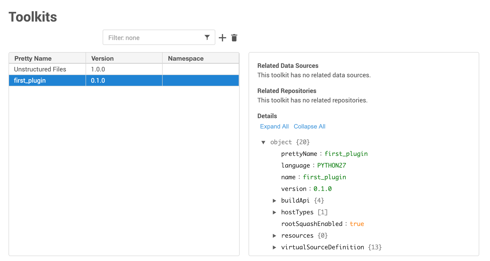

# Initial Setup

Before we begin to start writing plugin code, we will need to do some setup work. We will be using the `dvp` tool, which is described in the [Getting Started](/Getting_Started) section.

The quoted examples in this section assume you're working on a Unix-like system. (TODO: what development environments do we support? Should we call out Windows as special?)

## Sanity check

First a reminder that it's highly recommended that you develop your plugin in a "virtual environment."

(TODO: Link to best practices and/or glossary).

Next, make sure you have a Delphix Engine ready to use, as described in the [Prerequisites](Overview/#prerequisites) section on the previous page.

Finally, let's quickly make sure that `dvp` is working! Type `dvp -h` and you should see something like the following:
```
(venv)$ dvp -h
Usage: dvp [OPTIONS] COMMAND [ARGS]...

  The tools of the Delphix Virtualization SDK that help develop, build, and
  upload a plugin.

Options:
  --version      Show the version and exit.
  -v, --verbose  Enable verbose mode. Can be repeated up to three times for
                 increased verbosity.
  -q, --quiet    Enable quiet mode. Can be repeated up to three times for
                 increased suppression.
  -h, --help     Show this message and exit.

Commands:
  build   Build the plugin code and generate upload artifact file using the...
  init    Create a plugin in the root directory.
  upload  Upload the generated upload artifact (the plugin JSON file) that...
```

If this looks good, you are ready to begin!

If, instead, you see something like the following, go back to [Getting Started](/Getting_Started) and make sure you setup everything correctly before continuing.
```
(venv)$ dvp
-bash: dvp: command not found
```

## Creating a Bare Plugin

To start, we will create a new directory where our new plugin code will live.
```
(venv)$ mkdir first_plugin
(venv)$ cd first_plugin
```

Now that we are in our new plugin directory, we can use the `dvp` tool to create a plugin for us. This plugin will be a mere skeleton -- it will not do anything useful until we modify it in the subsequent pages.

```
(venv) first_plugin$ dvp init -n first_plugin
```

The `-n` argument here means "plugin name." We are using the name `first_plugin`.

After running this command, you should see that files have been created for you:

```
(venv) first_plugin$ ls
plugin_config.yml	schema.json		src
```

These files are described below:

File | Description
--------------------|----------------------
`plugin_config.yml` | The [manifest](/References/Glossary/#manifest) file, provides a list of plugin properties
`schema.json`       | Contains [schemas](/References/Glossary/#schema) which provides custom datatype definitions
`src/plugin_runner.py` | A Python file which will eventually contain code that handles plugin [operations](/References/Glossary/#operation)


Open these files in your editor/IDE and take a look at them. At this point they will not have a lot of content, but we will add to them as we go through the next few pages.


## Building The New Plugin

The new files we created above have to get [built](/References/Glossary/#plugin-build) to produce a single [artifact](/References/Glossary/#artifact). This is done with the `dvp` tool.

```
(venv) first_plugin$ dvp build
```

After the build, you should see that the build process has created a new file called `artifact.json`.
```
(venv) first_plugin$ ls
artifact.json		plugin_config.yml	schema.json		src
```

## Uploading The New Plugin

Now using the `dvp` tool we can upload the artifact onto our Delphix Engine.

```
(venv) first_plugin$ dvp upload -e engine.company.com -u admin
```

The `-e` argument specifies the engine on which to install the plugin, and the `-u` argument gives the Delphix Engine user.

You will be prompted for a password.

Once the upload is finished, you can verify the installation from the Manage > Toolkits screen in the Delphix Engine UI.


